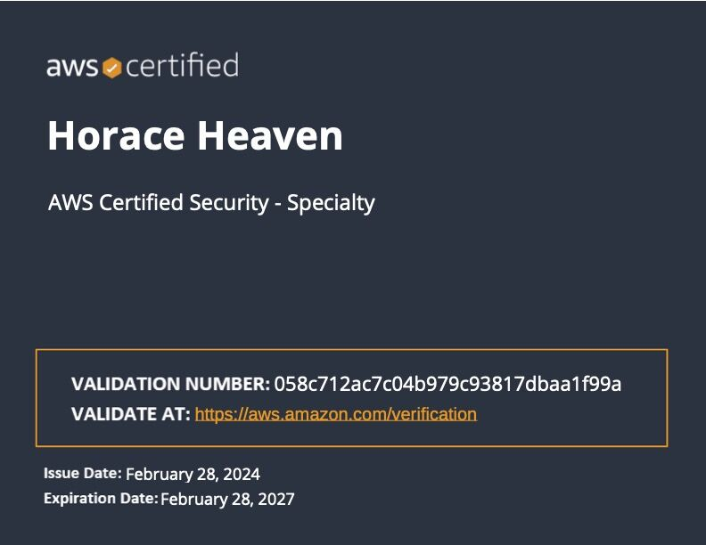

The AWS Certified Security – Specialty certification is designed for individuals who want to demonstrate their expertise in securing AWS workloads and maintaining a robust security posture in the AWS cloud. This advanced certification is ideal for security professionals with a deep understanding of AWS services and architecture, focusing on security practices and principles.

