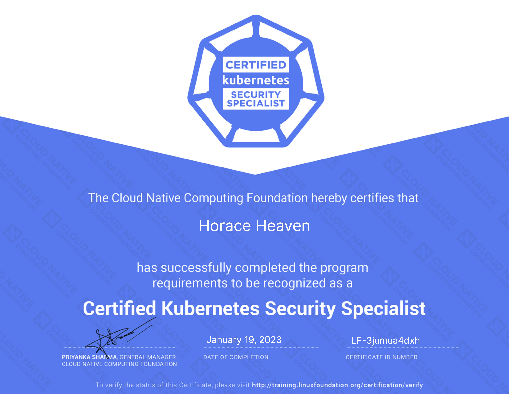

Obtaining a Kubernetes certification is a great way to validate your skills and expertise in using this powerful platform. One of the standout features of these exams is that they are entirely hands-on and scenario-driven, meaning that you will be tested on your ability to apply your knowledge in real-world situations. This practical approach ensures that you are fully prepared to tackle the challenges you may encounter in your Kubernetes career.

